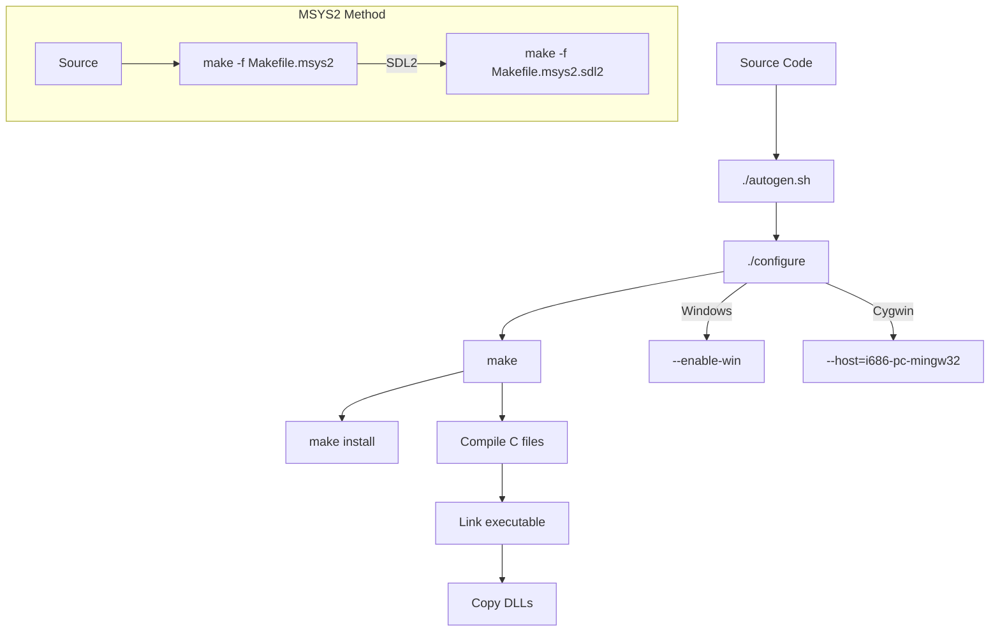

# Windows Compilation Guide for Angband

This document details various methods for compiling Angband on Windows platforms.

# Windows Compilation Methods for Angband

Angband can be compiled on Windows using several different methods, each with its own advantages and requirements.

## MinGW Compilation Method

MinGW (Minimalist GNU for Windows) provides a way to compile Angband using GCC on Windows.

### Setup
1. Install MinGW (http://www.mingw.org/)
2. Add MinGW's bin directory to your PATH
3. Install required dependencies (libpng, zlib)

### Compilation Steps
```bash
cd angband
./autogen.sh
./configure --enable-win
make
```

### Notes
- Produces native Windows executables
- Good compatibility with Windows APIs
- Smaller executable size compared to Cygwin
- May require manual DLL management

## Cygwin Compilation Method

Cygwin provides a UNIX-like environment for Windows, allowing Angband to be compiled with its standard build process.

### Setup
1. Install Cygwin (https://www.cygwin.com/)
2. Install development packages: gcc, make, autoconf, automake
3. Install required libraries: libpng-devel, zlib-devel

### Compilation Steps
```bash
cd angband
./autogen.sh
./configure --host=i686-pc-mingw32
make
```

### Notes
- Requires Cygwin runtime
- Good for developers familiar with UNIX environments
- Can produce both Cygwin-dependent and MinGW (native Windows) executables
- Larger executable size due to POSIX compatibility layer

## MSYS2 Compilation Method

MSYS2 is a modern development platform for Windows, combining MinGW with an updated package manager.

### Setup
1. Install MSYS2 (https://www.msys2.org/)
2. Install required packages:
   ```bash
   pacman -S mingw-w64-x86_64-gcc make autoconf automake
   pacman -S mingw-w64-x86_64-libpng mingw-w64-x86_64-zlib
   ```

### Compilation Steps
```bash
cd angband
make -f Makefile.msys2
```

### Notes
- Modern, well-maintained toolchain
- Good package management
- Can build with SDL2 support for better graphics
- Recommended for new Windows development

## Visual Studio Compilation Method

Visual Studio provides a native Windows development environment with its own compiler and tools.

### Setup
1. Install Visual Studio (Community edition is free)
2. Open the Visual Studio solution file in the win/vs2019 directory

### Compilation Steps
1. Open angband.sln
2. Select build configuration (Debug/Release)
3. Build Solution (F7)

### Notes
- Native Windows development experience
- Excellent debugging tools
- Good integration with Windows APIs
- Project files may need updating for newer Visual Studio versions
- Requires manual management of external dependencies

## Common Issues and Solutions

### DLL Dependencies
Windows builds often require DLLs to be distributed with the executable:
- libpng12.dll
- zlib1.dll

### Graphics Support
For tile graphics support, ensure:
- SDL2 is installed for MSYS2 builds
- GDI+ is available for Visual Studio builds

### Sound Support
For sound support:
- SDL_mixer for MSYS2/MinGW builds
- Windows Multimedia API for Visual Studio builds
## Compilation Flow Diagram


## Build Environment Matrix

| Method | Pros | Cons | Key Dependencies |
|--------|------|------|------------------|
| MinGW | Simple setup, standard build process | Limited graphics options | gcc, make, autoconf |
| MSYS2 | Modern, supports SDL2, active development | Larger installation footprint | mingw-w64-x86_64-gcc, SDL2 packages |
| Cygwin | UNIX-like environment, familiar tools | Performance overhead | mingw32 compiler packages |
| Visual Studio | Native IDE, debugging tools | Complex setup, project maintenance | MSVC toolchain, Windows SDK |

## Common Issues and Solutions

### DLL Missing Errors
If you encounter "Missing DLL" errors when running the compiled executable, ensure you've copied the required DLLs:
- libpng12.dll
- zlib1.dll

### Path Issues
Windows paths use backslashes, but the configure scripts expect forward slashes. Use forward slashes in your commands, e.g.:

```
./configure --prefix=C:/angband
```

### MSYS2 Environment Issues
If MSYS2 shell has trouble launching, try setting the MSYSTEM environment variable:

```
set MSYSTEM=MINGW64
```
