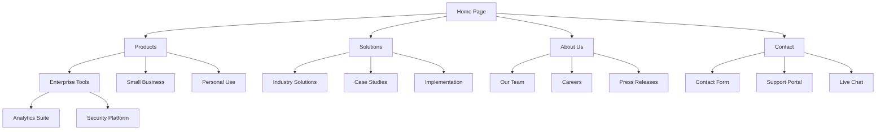

# AI-Driven UX Design Strategy

## Overview

AI tools are revolutionizing the UX design process, enabling rapid creation of user profiles, sitemaps, design documents, and user stories. This document outlines strategic approaches for leveraging AI in UX design workflows, based on observed best practices from tools like Grok 3, Claude, and others.

## Core UX Design Process with AI

### 1. User Research and Persona Development

#### AI-Enhanced Persona Creation

Use the following prompt structure with AI tools like Grok 3:

```json
{
  "prompt": "Analyze Personas",
  "role": {
    "ux_designer": true,
    "psychologist": true
  },
  "inputs": {
    "ideas": "[insert ideas]",
    "technical_specifications": "[insert tech specs]",
    "market_research": "[insert market analysis]"
  },
  "process": {
    "reflection": "Deeply analyze goals, motivations, pain points, behavior patterns, and user scenarios for each market segment.",
    "persona_creation": {
      "segmentation": "For broad market segments, create multiple personas. For narrow segments, create 1-2 personas.",
      "structure": {
        "name": "Persona Name",
        "age": "Age",
        "occupation": "Occupation",
        "location": "Location",
        "education": "Education Level",
        "tech_proficiency": "Level of tech proficiency",
        "lifestyle": "Day-to-day behaviors and preferences",
        "profile_overview": "Summary of the user's lifestyle, goals, and how they interact with technology"
      },
      "jobs_to_be_done": {
        "functional": "Task-oriented needs (e.g., scheduling, purchasing, communicating)",
        "emotional": "Underlying emotional needs (e.g., control, confidence, security)",
        "social": "Social positioning needs (e.g., appearing competent, credible, professional)"
      },
      "detailed_insights": {
        "goals_motivations": "Key outcomes the user wants to achieve",
        "pain_points": "Challenges preventing success",
        "behavior_patterns": "Common digital habits and interactions",
        "usage_context": "Scenarios and environments where the user interacts with the product",
        "user_quotes": "Direct quotes that summarize user experience",
        "design_implications": "Recommendations for design based on user needs"
      }
    }
  }
}
```

#### Example Output

```markdown
# Persona: Sarah Thompson

## Basic Information
- Age: 34
- Occupation: Marketing Manager at a mid-sized tech company
- Location: Chicago, IL
- Education: MBA in Marketing
- Tech Proficiency: High (early adopter)

## Profile Overview
Sarah leads a team of 5 marketing professionals and is responsible for campaign strategy, execution, and performance analysis. She works in a hybrid environment (3 days office/2 days remote) and juggles multiple projects with competing deadlines.

## Jobs to be Done
- Functional: Streamline campaign planning, track performance metrics, coordinate team tasks
- Emotional: Reduce stress from juggling priorities, gain confidence in data-driven decisions
- Social: Demonstrate expertise to leadership, maintain professional credibility with clients

## Detailed Insights

### Goals & Motivations
- Improve campaign ROI by 15% this quarter
- Reduce time spent on reporting by automating data collection
- Develop more cohesive cross-channel marketing strategies

### Pain Points
- Too much time spent gathering data from different platforms
- Difficulty visualizing campaign performance across channels
- Team communication gaps when working remotely

### Design Implications
- Prioritize unified dashboards showing cross-channel metrics
- Implement collaborative features for hybrid team coordination
- Create time-saving templates for recurring campaign tasks
```

### 2. Sitemap and Information Architecture Design

#### AI-Enhanced Sitemap Creation

Use this prompt structure:

```json
{
  "prompt": "Sitemap & Design Doc",
  "role": {
    "ui_designer": true,
    "ux_designer": true
  },
  "inputs": {
    "user_profiles": "[insert profiles]",
    "product_goal": "[insert tech specs, ideas, and high-level product overview]",
    "sitemap_notes": "[optional: insert proposed or existing sitemap]"
  },
  "process": {
    "step_1": {
      "task": "Ask 4-6 clarifying questions",
      "purpose": "Ensure understanding of the vision and constraints"
    },
    "step_2": {
      "task": "Draft an initial design document",
      "contents": [
        "High-Level UI/UX Design",
        "Sitemap in Mermaid Diagram Format",
        "Detailed Component Hierarchy"
      ],
      "feedback": {
        "request": "Ask for user approval",
        "response": "If feedback is provided, revise and return FULL document"
      }
    }
  }
}
```

#### Example Mermaid Sitemap Output



### 3. Feature Requirements and Information Architecture

#### AI-Enhanced Feature Specification

```json
{
  "prompt": "Feature Specs & Information Architecture",
  "role": {
    "ui_designer": true,
    "ux_designer": true
  },
  "inputs": {
    "product_overview": "[insert ideas and high-level product overview]",
    "design_specifications": "[insert design doc]"
  },
  "process": {
    "step_1": {
      "task": "Analyze documentation and ask 4-6 clarifying questions",
      "purpose": "Ensure deep understanding of UX, scalability, and information structure"
    },
    "step_2": {
      "task": "Generate comprehensive feature requirements",
      "workflow": {
        "feedback_request": "Ask for approval after full set of feature requirements is generated",
        "revision": "If feedback is provided, return ENTIRE set with feedback incorporated"
      }
    }
  }
}
```

### 4. User Stories and Acceptance Criteria

#### AI-Enhanced User Story Development

```json
{
  "prompt": "User Story Breakdown",
  "role": {
    "ux_designer": true,
    "business_analyst": true,
    "product_owner": true
  },
  "inputs": {
    "feature_requirements": "[insert feature reqs and info architecture]",
    "design_document": "[insert design docs]"
  },
  "example": {
    "user_story": "As a frequent online shopper, I want to filter products by price range so that I can quickly find items within my budget.",
    "acceptance_criteria": [
      {
        "given": "I am on the product listing page",
        "when": "I set a minimum and maximum price filter",
        "then": "Only products within that price range are displayed"
      },
      {
        "given": "I have applied a price filter",
        "when": "I click on the 'Clear Filters' button",
        "then": "The price filter is removed and all products are displayed"
      }
    ]
  }
}
```

## Integrated AI UX Design Workflow

### 1. Research and Planning (Day 1, Morning)
- Use AI to analyze market data and create detailed personas
- Generate initial product requirements based on personas

### 2. Information Architecture (Day 1, Afternoon)
- Create sitemap and navigation flow using AI-generated Mermaid diagrams
- Define content hierarchy and functional components

### 3. Feature Definition (Day 2, Morning)
- Generate detailed feature requirements
- Create component hierarchy and specifications

### 4. User Stories (Day 2, Afternoon)
- Convert features into user stories with acceptance criteria
- Refine and prioritize based on user value

### 5. Design Development (Day 3)
- Generate UI concepts based on the approved specifications
- Create interactive prototypes

## AI Tool Integration

### Grok 3 + Cursor Workflow

1. Use Grok 3 to generate UX deliverables:
   - End-user profiles and personas
   - Sitemap and design documentation
   - User stories with acceptance criteria

2. Feed outputs to Cursor along with technical specifications for:
   - Frontend implementation
   - Component development
   - Interaction logic

### Claude + Design Tools

1. Use Claude to develop:
   - Detailed user research synthesis
   - Information architecture maps
   - Interaction patterns

2. Export to design tools:
   - Convert Mermaid diagrams to Figma or Sketch
   - Use generated specifications for component creation
   - Reference user stories for interaction design

## Best Practices

### Maximizing AI UX Outputs

- **Be Specific**: Provide detailed context about users, market, and goals
- **Iterative Approach**: Generate, get feedback, refine in short cycles
- **Human Review**: Always review and validate AI outputs with stakeholders
- **Visual Formats**: Request Mermaid diagrams for hierarchy and flows
- **Standardized Structure**: Use consistent formats for personas, stories, and specifications
- **Technical Alignment**: Ensure UX designs align with technical capabilities
- **Feedback Loops**: Incorporate user feedback into prompt refinements

### Pitfalls to Avoid

- **Generic Outputs**: Avoid vague requirements in prompts
- **Skipping Validation**: Always verify AI-generated personas with real user data
- **Ignoring Edge Cases**: Ensure acceptance criteria cover exceptional scenarios
- **Overcomplicating**: Keep user stories focused on specific user value
- **Insufficient Context**: Provide comprehensive background for AI to generate relevant designs

## Metrics for Success

- **Time Efficiency**: Measure acceleration of UX design process
- **Consistency**: Evaluate alignment between design artifacts
- **Stakeholder Satisfaction**: Gather feedback on AI-generated designs
- **Implementation Accuracy**: Track translation of requirements to final product
- **User Satisfaction**: Measure user response to implemented designs

## Resources

- Mermaid Diagram Syntax: [Mermaid JS Documentation](https://mermaid-js.github.io/mermaid/)
- User Story Templates: See the User Story Breakdown prompt above
- AI UX Design Integration: Reference the Grok 3 workflow examples
